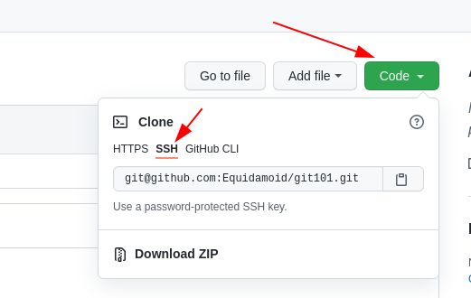

== Minimalistic git forking flow

This page summarises the bare minumum of actions needed to create your first pull-request.

I will use git command line api in all the examples.
Of course you can use whatever tool you want.
Check the documentation of the tool on how to perform these operations.

== Basics

=== Terminology

* *repository* – a git "database", contains history of your files and some other stuff
//* local copy – a directory on your local machine containing a `.git`
//directory, usually created with `git clone` or `git init`.
* *commit* - single "atomic" change in a repository, together with some metadata (text comment, timestamp, author name, etc.).
Every commit is identifed by a unique *commit hash* which is usually formatted as a long hex number (like `73001a1f31471fcb2db10fb729e540eb4abd8c3d`).
* *push* - an action of sending data from your local repository to a remote one
* *fetch* - inverse of push, getting data from remote repo and adding it to your local one
* *merge* - an action of combining changes made independently (e.g. when 2 people work on the same project at the same time)
* *clone* - an action of creating a local repository by making a copy of a remote one
* *fork* - a "copy" of someone's repository, usually available online

=== Placeholders

In all the examples some ``fake variables'' will be used for bits and pieces that you’ll have to change.
- REPONAME - name of the original repository (and unless you do something with it, the name of your fork) -

=== git vs github(tm)

Let’s not confuse them. - *git* is a
https://en.wikipedia.org/wiki/Distributed_version_control[distributed]
version control tool. - *github* is an online providing storage for your git repositories together with a convenient web gui for viewing them, sharing changes, managing access, etc.
There are similar services:
https://gitlab.com[gitlab], https://bitbucket.com[bitbucket] and many others.

In this document github is used as an example. Other services are expected to have similar functionality, but with
weird names sometimes (looking at you, azure).

=== The process

==== Fork

In this workflow we use forks. There are alternative ways, but discussing them is outside of this document's scope.

To start working you will have to create a fork. Just go to the main repository's page and click that "fork" button on
the top-right. Use the default name for the fork for simplicity.

This is only done once.

==== Clone your fork

_prerequisite_: in this guide we assume that you already
https://docs.github.com/en/github/authenticating-to-github/connecting-to-github-with-ssh/generating-a-new-ssh-key-and-adding-it-to-the-ssh-agent[created] an ssh key and
https://docs.github.com/en/github/authenticating-to-github/connecting-to-github-with-ssh/adding-a-new-ssh-key-to-your-github-account[added it] to your github account.

Go to **your fork**'s page and get the clone url:



Find a place where you want to keep a copy of the project you'll be working with and **clone** your fork by running
`git clone $URL` (where `$URL` is the email-looking string you just copied, like `git@github.com:Equidamoid/git101.git`).

You only need to do it once, unless you deleted a previous clone or have a reason do have two (you’ll know when it’s the case).

==== Work

Well, change the files, test your changes, etc. etc. Just keep the `.git` directory alone.

Don’t worry, you won’t break anything.

===== If you break something
There are multiple ways to recover, the most straightforward are:

 - If you are okay with losing everything after the last *push* (see below), just delete the directory and *clone* again.
 - If you are okay with losing changes after the last *commit* (see below), run `git checkout .` (this won't delete any new files, see `man git clean` for a more thorough cleanup).
 - Take a long look at the outputs of `git diff` and `git diff --staged` to see what has changed since the last commit.

==== Commit

After you finished some part of the work it's time to save the files(*) to the repository. It's a two-stage project:

===== Staging the changes
First we need to tell git what we want to be committed ("saved"). You do this by running `git add $filename`, where `$filename` is
the path to a file you want to commit (== where meaningful changes were made).

You can always see what you staged and what not by running `git status`:
```
└─[1] <git:(master 62ceb68✱+) > git status
On branch master
Your branch is up to date with 'origin/master'.

Changes to be committed:
  (use "git restore --staged <file>..." to unstage)
        new file:   pic/gh_clone.png

Changes not staged for commit:
  (use "git add <file>..." to update what will be committed)
  (use "git restore <file>..." to discard changes in working directory)
        modified:   README.adoc
```
Here plan to commit `pic/gh_clone.png`, but not `README.adoc`.

If you `git add` 'ed too much, run `git reset` and start over.

===== Making the commit
After you staged everything you wanted, (and `git status` confirms it), run `git commit`.

An editor will pop up asking for a message. Write a short description of the changes you made (not something like "edited some files", "aaaa", "."), save the file and exit the editor.

If the editor is https://www.nano-editor.org/[too scary], you can just run `git commit "your commit message here"` (mind the quotes!).


(*) Technically it’s not the files themselves, but the difference from the previous version, but that doesn’t matter now.

This action is repeated, just keep the commits meaningful.

.What to commit
[NOTE]
===============================
Make sure you only commit the stuff that has to be committed, like

 - code
 - documentation

...and not various junk that can be made from the data you committed or only matters for your local setup:

 - logs
 - intermediate files
 - binaries (from executables to `pdf` files generated by latex)
===============================

==== Push

After you made one or more commits you can *push* ("upload") them to the remote repository by running `git push`.
